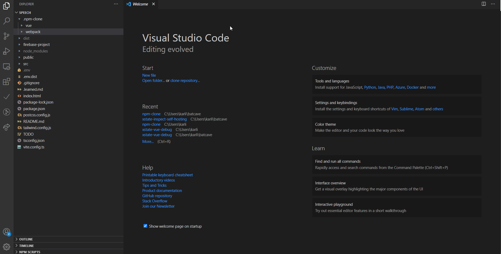

# Npm Clone Package

> Easily git clone a npm package

This extension ease the code discovery of a npm package. 

## Features

- Add a new command entry "Clone a NPM package" that will clone the requested package inside a `.npm_clone` directory.



_The .npm_clone directory will be create in the active workspace root_

## Under the hood

It's basically just a set of:

```
npm view {packageName}
mkdir {activeWorkspace}/.npm_clone
cd .npm_clone && git clone {packageView.repository}
```
### 0.0.2

Initial release

